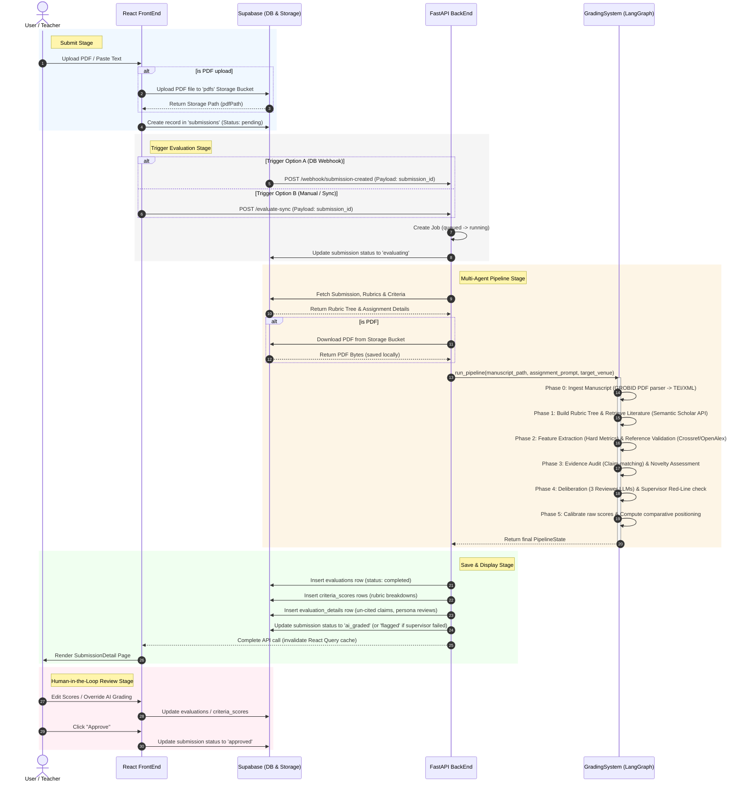

# End-to-End Submission & AI Evaluation Flow

This document details the end-to-end technical flow of the GradioAI application, starting from a user submitting an assignment in the front-end interface, processing it through the Python backend and LangGraph multi-agent grading engine, and ending with database persistence and manual review approval.

---

## High-Level System Architecture

The application is structured into four main components:
1. **FrontEnd**: A React (TypeScript/Vite) application utilizing React Query for state management and Supabase client mutations.
2. **Supabase Backend**: Handles database tables, file storage for PDF files, and webhook delivery.
3. **BackEnd (API)**: A Python FastAPI application that manages job queues, downloads resources from storage, and acts as the orchestrator.
4. **GradingSystem (Agentic Pipeline)**: A LangGraph state machine executing asynchronous, multi-agent tasks including retrieval, feature extraction, evaluation, and calibration.

---

## Detailed Step-by-Step Execution

### Step 1: Submission Trigger
The process starts in the frontend page `AssignmentDetailPage.tsx` when a user adds a submission (manually or in bulk):
* **Text Submission**: If text is pasted, the client creates a record directly in the `submissions` table in Supabase via the `useCreateSubmission` hook.
* **PDF Submission**:
  1. The client sends the PDF to a Supabase edge function `/parse-pdf` to extract raw text content for editing and rendering.
  2. The raw PDF file is uploaded to the Supabase Storage bucket named `pdfs` under `student_id/timestamp-filename.pdf`.
  3. The client inserts the database record in the `submissions` table, adding the storage reference (`pdf_path`).
  4. The client then issues a POST request to `/evaluate-sync` on the python backend.

### Step 2: Ingestion & Job Queueing
The Python backend (FastAPI based, under `BackEnd/src`) receives the evaluation request via three possible routes:
1. **POST `/webhook/submission-created`**: Triggers automatically on Supabase `INSERT` for any submission with status `pending`.
2. **POST `/evaluate`**: Queues the evaluation asynchronously and returns a `job_id`.
3. **POST `/evaluate-sync`**: Runs the evaluation and blocks the client connection, polling the job status until completion or timeout (up to 500 seconds).

The backend's routing layer (`BackEnd/src/routes/evaluate.py`) validates that no active job is already processing the submission and creates a job entry with status `queued` in the local job manager.

### Step 3: Background Worker Execution
The FastAPI background task runner launches `run_text_pipeline` or `run_pdf_pipeline` inside `pipeline_worker.py`:
1. It acquires the concurrency semaphore to cap maximum parallel evaluations.
2. It fetches submission details, rubric ID, rubric criteria, and assignment parameters (prompt, target venue, submission type) from Supabase.
3. It updates the database status of the submission to `evaluating`.
4. **PDF Preparation**: If the submission lists a `pdf_path`, it downloads the raw PDF from Supabase Storage and saves it to a static location `static/pdfs/{submission_id}.pdf`. If it is text-only, it generates a temporary `.txt` file.
5. It calls the synchronous multi-agent pipeline in a thread pool (`asyncio.to_thread(_run_pipeline_sync, ...)`).

### Step 4: Multi-Agent Grading Pipeline (GradingSystem)
The pipeline is managed as a LangGraph state machine inside `GradingSystem/grading_system_src/orchestration/graph.py`:
* **Phase 0: Ingestion (`ingest`)**:
  * Uses a GROBID client to parse PDF files into structured XML/TEI. If the file is plain text, it bypasses this tool.
* **Phase 1: Goal Setting (Parallel)**:
  * **`rubric`**: Builds/retrieves the rubric tree based on the assignment prompt and venue-specific guidelines (e.g. NeurIPS or ACL guidelines).
  * **`retrieval`**: Queries external databases (Semantic Scholar API) using the manuscript's title and abstract to retrieve a pool of related literature.
* **Phase 2: Feature Extraction & Verification (Parallel)**:
  * **`features`**: Deterministically extracts linguistic, stylistic, and structural features (cohesion, lexical diversity, grammar, psycholinguistics, citations).
  * **`ref_validation`**: Validates the list of references in the manuscript against metadata catalogs (Crossref/OpenAlex) to identify invalid or potentially hallucinated citations.
* **Phase 3: Deep Verification (Parallel)**:
  * **`evidence`**: Evaluates whether claims in the manuscript match the retrieved literature pool and lists uncited claims or claims that conflict with literature evidence.
  * **`novelty`**: Assesses the novelty of the claims/contributions in comparison to existing literature.
* **Phase 4: Synthesis & Supervision**:
  * **`synthesis`**: Runs a multi-persona LLM deliberation (3 distinct reviewer personas debate the manuscript, vote, and synthesize verdicts).
  * **`supervisor`**: Runs a supervisor agent checking for "red-line" violations (e.g. grading style, contradictions, logical errors).
    * If a violation occurs, the supervisor can loop back to `synthesis` up to 1 time to regenerate the evaluation.
    * If violations persist beyond the threshold, it flags the submission (`human_flag = True`), requiring teacher calibration.
* **Phase 5: Calibration & Comparative Scoring (`calibrate`)**:
  * Calibrates the raw score against human-calibration data and positions the paper competitively against venue thresholds (e.g. ACL/NeurIPS target acceptance distributions).
  * Produces a final calibrated score and venue percentile metrics.

### Step 5: Persistence to Supabase
Once `run_pipeline` completes and returns the final `PipelineState`, the backend mapping service (`BackEnd/src/mapping/result.py`) translates the graph state into Supabase-compatible schemas:
1. **`evaluations`**: Sets final overall score, max possible score, confidence level (reduced for each supervisor violation), strengths/weaknesses, and general improvement suggestions. Status is marked as `completed`.
2. **`criteria_scores`**: Inserts individual criteria scores (leaf rubric scores, explanations, and quotes/evidence verified in the text).
3. **`evaluation_details`**: Writes extensive debugging/analytical payload (uncited claims, novelty claims, persona deliberations, disagreement flags, red-line violations, and verification ratios).
4. The database status of the submission is updated:
   * If the supervisor flagged it (`human_flag = True`), status becomes `flagged`.
   * Otherwise, status becomes `ai_graded`.
5. The background job status is set to `completed`.

### Step 6: Rendering Results to the Teacher (FrontEnd View)
When the front-end React Query cache is invalidated, the UI fetches the updated submission data:
* **Interactive Pipeline Status**: `SubmissionDetail.tsx` displays the review pipeline status bar tracking steps from `Pending` $\rightarrow$ `Evaluating` $\rightarrow$ `AI Graded`.
* **Side-by-Side Review Screen**:
  * **Left Side**: Displays the original PDF document in an `iframe` viewer (or the raw text if no PDF was provided).
  * **Right Side**: Displays the overall score, the AI confidence level, and an interactive **Rubric Breakdown** showing individual criterion scores with progress bars. Clicking on a criterion displays the AI explanation, a **"To reach next level"** action step, and clickable text quotes showing exactly *where* the AI found supporting evidence in the manuscript.

### Step 7: Human-in-the-Loop Override & Final Approval
1. **AI Score Overrides**: The teacher can edit the overall grade, individual criteria scores, or the generated feedback. Any edits are saved to `criteria_scores` and flagged in the UI (e.g. *"You overrode AI (3.5 $\rightarrow$ 5.0)"*).
2. **Review & Approve**: The teacher can update the status to `human_reviewed` or click **"Approve"** to set the submission status to `approved`, saving the final grade and completing the cycle.

---

## Data Models and Table Relationships

### Submissions Table (`submissions`)
Represents a student's submission.
* `id` (UUID): Primary Key
* `status` (text): Current processing status (`pending`, `evaluating`, `ai_graded`, `needs_review`, `human_reviewed`, `approved`)
* `content` (text): Extracted text content of the manuscript
* `pdf_path` (text, nullable): The folder path of the PDF stored in Supabase Storage
* `rubric_id` (UUID, Foreign Key): Rubric used to score the submission
* `assignment_id` (UUID, Foreign Key): Parent assignment
* `student_id` (UUID, Foreign Key): Submitting student

### Evaluations Table (`evaluations`)
Contains summary stats and synthesized reviews.
* `id` (UUID): Primary Key
* `submission_id` (UUID, Foreign Key)
* `total_score` (numeric): Calibrated score mapped to the rubric's max points
* `max_possible_score` (numeric): Maximum total score from all active rubric criteria
* `confidence` (numeric): Score confidence percentage based on supervisor red-line checks
* `overall_feedback` (text): Consensus synthesis text generated by reviewer personas
* `content_feedback` (text, nullable): Extracted/curated strengths list
* `structure_feedback` (text, nullable): Extracted/curated weaknesses list
* `improvement_suggestions` (text, nullable): Synthesized actions for uncited, redundant, or fabricated references
* `status` (text): Status of writing this evaluation (`completed`, `in_progress`)

### Criteria Scores Table (`criteria_scores`)
Holds granular scores mapped to specific rubric criteria.
* `id` (UUID): Primary Key
* `evaluation_id` (UUID, Foreign Key)
* `criterion_id` (UUID, Foreign Key)
* `score` (numeric): Final score (AI-generated or human-overridden)
* `ai_score` (numeric): Original AI score generated by the pipeline (never overridden)
* `explanation` (text): Level-based justification text
* `evidence` (text, nullable): Verified quote snippet matching this criterion in the manuscript

### Evaluation Details Table (`evaluation_details`)
Diagnostic/metadata table for advanced evaluation details.
* `evaluation_id` (UUID, Foreign Key, Primary Key)
* `uncited_claims` (JSON): Claims identified as missing literature citations
* `low_similarity_citations` (JSON): Citations with low Semantic Scholar content overlap
* `novelty_score` (numeric): Calculated novelty percentile
* `novelty_claims` (JSON): Claims annotated with novelty classification (e.g., `REDUNDANT`, `NOVEL`)
* `persona_reviews` (JSON): Raw feedback generated by individual reviewer personas
* `red_line_violations` (JSON): Captured supervisor violations
* `human_flag` (boolean): Flag indicating that the pipeline requires human inspection
* `overall_percentile` (numeric): Comparative venue percentile
* `verified_ratio` (numeric): Ratio of references successfully verified against Crossref/OpenAlex
* `fabricated_refs` (JSON): List of references labeled as potentially fabricated
