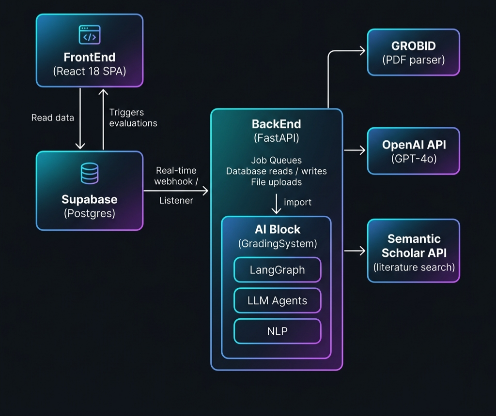

# VinReviewer

An AI-powered academic submission review platform. Instructors upload student papers; the system evaluates them against a custom rubric using either a fast Gemini-based evaluator or a full multi-agent pipeline with evidence auditing, novelty detection, multi-persona deliberation, and calibrated scoring.

---

## Architecture



<details>
<summary>Show text-based architecture diagram</summary>

```
┌──────────────────────────────────────────────────────────────────┐
│                        VinReviewer Platform                       │
├──────────────────────────────────────────────────────────────────┤
│                                                                  │
│  ┌─────────────┐          ┌──────────────┐                      │
│  │  FrontEnd   │─ reads ─▶│   Supabase   │◀─ writes ─┐         │
│  │  (React)    │          │  (Postgres)  │           │         │
│  └──────┬──────┘          └──────┬───────┘           │         │
│         │                        │                    │         │
│         │ triggers eval          │ webhook / Realtime │         │
│         ▼                        ▼                    │         │
│  ┌─────────────────────────────────────────────────┐  │         │
│  │             BackEnd  (FastAPI)                   │──┘         │
│  │                                                 │            │
│  │  • Job queue & concurrency control              │            │
│  │  • Supabase DB client (reads + writes)          │            │
│  │  • Rubric mapping  (DB schema → RubricTree)     │            │
│  │  • Result mapping  (PipelineState → DB rows)    │            │
│  │  • File handling   (upload, temp, cleanup)      │            │
│  │                                                 │            │
│  │         imports GradingSystem as a library       │            │
│  │                      ▼                          │            │
│  │  ┌──────────────────────────────────────────┐  │            │
│  │  │          GradingSystem Pipeline           │  │            │
│  │  │  LangGraph · Agents · LLMs · GROBID       │  │            │
│  │  └──────────────────────────────────────────┘  │            │
│  └─────────────────────────────────────────────────┘            │
│                                                                  │
└──────────────────────────────────────────────────────────────────┘
```

</details>

### Folder layout

```
VinReviewer/
├── FrontEnd/          React 18 + Supabase + Tailwind UI
├── BackEnd/           FastAPI orchestration service  (NEW)
├── GradingSystem/     Python multi-agent review pipeline
├── docker-compose.yml GROBID + BackEnd services
└── README.md
```

---

## Components

### FrontEnd

> React 18 · TypeScript · Vite · Tailwind CSS · shadcn/ui · Supabase · React Query

The instructor-facing web application.

| Feature | Description |
|---------|-------------|
| Classes & Students | Create classes, roster students |
| Assignments | Create assignments with custom rubrics and per-criterion scoring |
| Submissions | Single upload (PDF or text), bulk upload dialog, drag-and-drop |
| Evaluation | Trigger AI evaluation per submission or in bulk; poll status |
| Submission Detail | Per-criterion scores, evidence quotes, confidence badges, human override |
| Analytics | Score distribution, per-criterion breakdown, AI-generated insights |
| Settings tab | Submission type (essay / research paper), target venue, advanced evaluation toggle |

**Key source files**

| Path | Role |
|------|------|
| `src/pages/AssignmentDetailPage.tsx` | Main assignment view — submissions, rubric, analytics, settings |
| `src/pages/ClassDetailPage.tsx` | Class detail — students, assignments, analytics with CSV validation |
| `src/components/SubmissionDetail.tsx` | Per-submission review UI with XSS-safe content rendering |
| `src/components/ErrorBoundary.tsx` | Top-level React error boundary with fallback UI |
| `src/components/analytics/SectionHeader.tsx` | Shared collapsible section header for analytics panels |
| `src/components/analytics/MiniStat.tsx` | Shared mini stat card component |
| `src/components/BulkSubmissionDialog.tsx` | Bulk PDF/text upload |
| `src/hooks/useData.ts` | React Query hooks for all DB tables |
| `src/hooks/useAssignments.ts` | Assignment-specific mutations |
| `src/lib/analytics.ts` | Pure utility functions — distribution, percentiles, outliers, criteria breakdown |
| `src/lib/sanitize.ts` | HTML entity escaping for XSS prevention |
| `src/lib/constants.ts` | Shared constants — confidence threshold, CSV limits |
| `src/types/database.ts` | TypeScript interfaces for all database entities |
| `supabase/functions/evaluate/` | Deno edge function — Gemini evaluator with BackEnd proxy |
| `supabase/functions/parse-pdf/` | Deno edge function — Gemini PDF text extraction |
| `supabase/migrations/` | Full Postgres schema history |

---

### BackEnd

> Python 3.11 · FastAPI · Uvicorn · supabase-py · pydantic-settings

HTTP service that bridges FrontEnd (Supabase) and GradingSystem.

**API endpoints**

| Method | Path | Description |
|--------|------|-------------|
| `GET` | `/health` | Readiness — checks GROBID + Supabase + model load |
| `POST` | `/evaluate` | Queue text submission for agentic pipeline |
| `POST` | `/evaluate-pdf` | Accept PDF upload, queue GROBID + pipeline |
| `GET` | `/jobs/{job_id}` | Poll job status and result |
| `POST` | `/webhook/submission-created` | Supabase DB webhook on new submission INSERT |

All mutating endpoints require `X-API-Key` header.

**Source layout**

```
BackEnd/src/
├── main.py                 FastAPI app + lifespan + correlation ID middleware
├── config.py               Pydantic Settings (reads .env)
├── exceptions.py           Custom exception hierarchy (PipelineError, ValidationError, SupabaseError)
├── routes/
│   ├── evaluate.py         /evaluate, /webhook, /jobs — with idempotency checks
│   ├── pdf.py              /evaluate-pdf — with idempotency checks
│   └── health.py           /health
├── services/
│   ├── evaluator.py        Unified evaluator with rollback on partial write failure
│   ├── job_manager.py      In-memory job queue + asyncio semaphore + find_active_job()
│   └── supabase_client.py  Async Supabase wrapper + delete_evaluation() for rollback
├── models/
│   └── responses.py        Typed Pydantic response models (EvaluateResponse, WebhookResponse)
├── mapping/
│   ├── rubric.py           criteria[] → RubricTree
│   └── result.py           PipelineState → evaluations / criteria_scores / evaluation_details
└── workers/
    └── pipeline_worker.py  Semaphore-gated background task runner with timeout enforcement
```

---

### GradingSystem

> Python 3.11 · LangGraph · LangChain · OpenAI · GROBID · sentence-transformers · spaCy

A pure review pipeline — no web framework, no DB. Imported as a library by BackEnd.

**Pipeline phases** (run via `run_pipeline(manuscript_path, assignment_prompt, target_venue)`)

```
Phase 0  Ingest          Single-pass PDF parsing via GROBID + language detection
                         ↓
Phase 1a Rubric          Build RubricTree (venue-aware dimension weighting)
Phase 1b Retrieval       Fetch related literature from Semantic Scholar   ┐ parallel
Phase 1c Features        Linguistic + structural feature extraction        ┘
Phase 2b Ref Validation  Parallel reference verification (ThreadPoolExecutor)
                         ↓
Phase 3  Evidence Audit  Claim → citation similarity scoring (uncited / hallucinated)
Phase 3b Novelty         Contribution classification: NOVEL / INCREMENTAL / REDUNDANT
                         ↓
Phase 4  Deliberation    3 reviewer personas (methodology, domain, communication)
                         → vote → merged LeafVerdicts
Phase 4b Supervisor      Red-line checks (R1–R7); triggers regen or human flag
                         ↓
Phase 5  Calibration     Monotone affine score calibration + percentile positioning
```

Each pipeline node validates required input fields before executing; missing fields produce clear error messages rather than AttributeError crashes. Nodes that fail are caught and recorded in `state["errors"]` with full context.

**Shared modules**

| Module | Description |
|--------|-------------|
| `src/llm.py` | Centralized `get_llm()` factory + `invoke_llm()` retry wrapper (tenacity) |
| `src/model_cache.py` | Thread-safe singleton cache for sentence-transformers + encoders |
| `src/prompts.py` | `load_prompt(name)` — loads from `prompts/*.txt` with LRU cache |
| `src/exceptions.py` | `LLMParseError`, `IngestError`, `FeatureExtractionError` |

**Key models** (`GradingSystem/src/models.py`)

| Model | Description |
|-------|-------------|
| `PipelineState` | Full state object threaded through all LangGraph nodes |
| `RubricTree` / `RubricNode` | Weighted rubric dimension tree |
| `EvidenceAudit` | Uncited claims + low-similarity citations |
| `NoveltyAssessment` | Per-claim novelty classification + overall score |
| `DeliberationResult` | Persona reviews, disagreement flags, final verdicts |
| `SupervisorResult` | Red-line violations, regen count, human flag |
| `ComparativePosition` | Percentile vs. reference corpus + venue tier |

---

## Database Schema

Managed via Supabase migrations in `FrontEnd/supabase/migrations/`.

**Core tables**

| Table | Description |
|-------|-------------|
| `classes` | Instructor classes |
| `students` | Student roster |
| `class_students` | Junction table |
| `assignments` | Assignments with rubric FK, `submission_type`, `target_venue`, `use_agentic_evaluation` |
| `rubrics` | Named rubric attached to an assignment |
| `criteria` | Rubric criteria with `weight`, `max_score`, `sort_order` |
| `submissions` | Student submissions with `content`, `status`, `rubric_id` |
| `evaluations` | Evaluation results — scores, feedback, confidence, `evaluation_type` |
| `criteria_scores` | Per-criterion scores with evidence and hallucination flags |
| `evidence_spans` | Character-level evidence quote spans with match scores |
| `evaluation_details` | Rich agentic pipeline output (novelty, deliberation, red-lines, comparative) |

**Submission status flow**

```
pending → evaluating → ai_graded
                     → needs_review   (low confidence / hallucinated evidence)
                     → flagged        (supervisor human_flag)
                     → approved       (instructor sign-off)
```

---

## Evaluation Modes

| Mode | Trigger | Evaluator | Output |
|------|---------|-----------|--------|
| **Simple** | `use_agentic_evaluation = false` | Gemini 2.5 Pro via Edge Function | Rubric scores + evidence verification |
| **Agentic** | `use_agentic_evaluation = true` or `submission_type = research_paper` | Full GradingSystem pipeline via BackEnd | All of the above + novelty, deliberation, red-lines, comparative percentile, `evaluation_details` row |

The Edge Function auto-proxies to BackEnd when `BACKEND_URL` and `BACKEND_API_KEY` are set and the assignment is configured for agentic evaluation.

---

## Quick Start

### Prerequisites

- Docker (for GROBID)
- Supabase project with service role key

**Option A — Conda (recommended)**
- Conda or Miniconda

**Option B — Manual**
- Node.js  20.19+ or 22.12+ / Bun 1.x
- Python 3.11+

### 1. Clone and configure

```bash
git clone https://github.com/your-org/VinReviewer.git
cd VinReviewer

# BackEnd environment
cp BackEnd/.env.example BackEnd/.env
# Edit BackEnd/.env — fill in SUPABASE_URL, SUPABASE_SERVICE_KEY, OPENAI_API_KEY, API_KEY
```

### 2. Start GROBID

```bash
docker run -d --name grobid -p 8070:8070 lfoppiano/grobid:0.8.1
```

Wait ~30s, then verify: `curl http://localhost:8070/api/isalive`

### 3. Apply database migrations

```bash
cd FrontEnd
npx supabase db push
```

### 4. Install dependencies

#### Option A — Conda

```bash
# Create environment with Python and Node.js
conda create -n vinreviewer python=3.11 nodejs=18 -y
conda activate vinreviewer

# GradingSystem
cd GradingSystem
uv pip install -e ".[dev]"
python -m spacy download en_core_web_sm

# BackEnd (+ link GradingSystem as local dep)
cd ../BackEnd
uv pip install -e ".[dev]"
uv pip install -e ../GradingSystem

# FrontEnd
cd ../FrontEnd
npm install
```

> **Tip:** If `sentence-transformers` or `torch` fails via pip, install them through conda first:
> ```bash
> conda install -c conda-forge sentence-transformers
> conda install pytorch cpuonly -c pytorch
> ```

#### Option B — Manual (pip + npm/bun)

```bash
# GradingSystem
cd GradingSystem
pip install -e ".[dev]"
python -m spacy download en_core_web_sm

# BackEnd
cd ../BackEnd
pip install -e ".[dev]"
pip install -e ../GradingSystem

# FrontEnd
cd ../FrontEnd
npm install   # or: bun install
```

### 5. Configure FrontEnd environment

Create `FrontEnd/.env`:

```
VITE_SUPABASE_URL=https://your-project.supabase.co
VITE_SUPABASE_PUBLISHABLE_KEY=your-anon-key
```

### 6. Run locally

Open three terminals (activate conda in each if using Option A):

```bash
# Terminal 1 — BackEnd (port 8000)
cd BackEnd
uvicorn src.main:app --reload --port 8000

# Terminal 2 — FrontEnd (port 5173)
cd FrontEnd
npm run dev   # or: bun dev

# Terminal 3 — Edge Functions (optional, for simple evaluation mode)
cd FrontEnd
npx supabase functions serve
```

| Service | URL | Check |
|---------|-----|-------|
| FrontEnd | http://localhost:5173 | Dashboard loads |
| BackEnd | http://localhost:8000/health | `{"status": "ok", ...}` |
| GROBID | http://localhost:8070/api/isalive | 200 OK |

### 7. Run with Docker Compose (alternative to step 6)

```bash
# From the VinReviewer/ root
docker compose up --build
# BackEnd → http://localhost:8000
# GROBID  → http://localhost:8070
```

### 8. Configure Edge Function secrets (Supabase)

```bash
cd FrontEnd
supabase secrets set BACKEND_URL=http://your-backend-host:8000
supabase secrets set BACKEND_API_KEY=your-api-key
supabase functions deploy evaluate
```

---

## Environment Variables

### BackEnd (`BackEnd/.env`)

| Variable | Required | Description |
|----------|----------|-------------|
| `SUPABASE_URL` | ✅ | Supabase project URL |
| `SUPABASE_SERVICE_KEY` | ✅ | Supabase service role key (never exposed to client) |
| `OPENAI_API_KEY` | ✅ | OpenAI key for LLM agents |
| `API_KEY` | ✅ | Shared secret for `X-API-Key` header |
| `GROBID_URL` | — | Default `http://localhost:8070` |
| `SEMANTIC_SCHOLAR_API_KEY` | — | For literature retrieval (optional) |
| `MAX_CONCURRENT_JOBS` | — | Default `5` |
| `JOB_TIMEOUT_SECONDS` | — | Default `600` |
| `REDIS_URL` | — | Optional Redis for production job queue |

### FrontEnd (Vite / Supabase Edge Functions)

| Variable | Description |
|----------|-------------|
| `VITE_SUPABASE_URL` | Supabase project URL |
| `VITE_SUPABASE_PUBLISHABLE_KEY` | Supabase anon key |
| `LOVABLE_API_KEY` | Lovable AI gateway key (for Gemini models) |
| `BACKEND_URL` | BackEnd base URL (edge function secret) |
| `BACKEND_API_KEY` | BackEnd API key (edge function secret) |

---

## Testing

### BackEnd

```bash
cd BackEnd
pytest
```

Tests cover:
- Route authentication and response shapes (`tests/test_routes.py`)
- Rubric weight normalisation and ordering (`tests/test_mapping.py`)
- Evaluator error paths — missing rubric, empty criteria, pipeline errors (`tests/test_evaluator.py`)

### GradingSystem

```bash
cd GradingSystem
pytest
```

Tests cover all pipeline phases: calibration, citations, cohesion, deliberation, novelty, references, supervisor, and more.

### FrontEnd

```bash
cd FrontEnd
bun test          # Vitest unit tests
bun playwright    # Playwright E2E tests
```

---

## Security Notes

- The Supabase **service role key** is only held by BackEnd — never sent to the browser.
- All BackEnd mutating endpoints require `X-API-Key`; keys are compared with `secrets.compare_digest` to prevent timing attacks.
- Uploaded PDFs are streamed to a temp file and deleted immediately after the pipeline completes.
- Submission content is processed in-memory; nothing is persisted outside Supabase.
- User-submitted content is HTML-entity-escaped before rendering to prevent XSS.
- CSV student uploads are validated for file size (5 MB), row count (500), email format, and duplicates.
- Maximum PDF upload size: **50 MB**. Maximum concurrent pipeline jobs: **5** (configurable).
- All HTTP requests carry a correlation ID (`X-Correlation-ID`) for traceability; structured logging includes it in every log line.

---

## Deployment

| Platform | Notes |
|----------|-------|
| **Docker Compose** | Single-host; use `docker compose up --build` from root |
| **Railway / Render** | Push `BackEnd/` service; add env vars in dashboard |
| **AWS ECS / GCP Cloud Run** | Use the `BackEnd/Dockerfile`; mount or install GradingSystem at build time |
| **Supabase Edge Functions** | FrontEnd edge functions deploy via `supabase functions deploy` |

For production, set `MAX_CONCURRENT_JOBS` based on available memory (sentence-transformers requires ~1 GB per instance) and consider adding a Redis-backed job queue via `REDIS_URL`.
